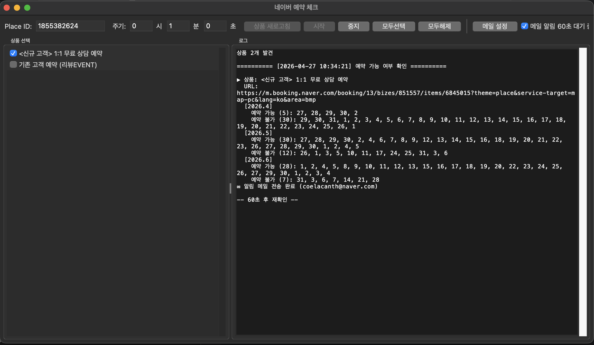
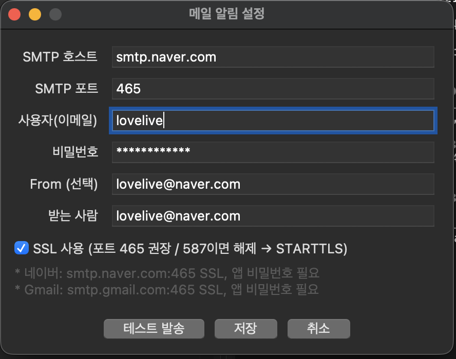

# 네이버 예약 체크 (NaverReservationCheck)

네이버 플레이스(`pcmap.place.naver.com`)에 등록된 상품의 **예약 가능 날짜**를 주기적으로 확인하고, 가능 날짜가 변경되면 메일로 알려주는 GUI 도구입니다. Tkinter UI + Playwright(Chromium Headless)로 동작하며, macOS와 Windows 모두 지원합니다.

## 주요 기능

- Place ID 기반으로 해당 가게의 모든 예약 상품 자동 탐색
- 상품별 향후 3개월 달력에서 예약 가능/불가 날짜 추출
- 사용자 지정 주기(시/분/초)로 반복 체크
- 예약 가능 상태가 바뀔 때 SMTP로 메일 알림 (네이버/Gmail 등)
- 설정은 `~/.naver_reservation_check.json`에 저장

## 요구 환경

- macOS 또는 Windows 10/11
- Python 3.10+ 권장
- 인터넷 연결

## 의존성 설치

### macOS / Linux

```bash
python3 -m venv .venv
source .venv/bin/activate

pip install playwright pyinstaller
python -m playwright install chromium
```

### Windows (PowerShell)

```powershell
python -m venv .venv
.\.venv\Scripts\Activate.ps1

pip install playwright pyinstaller
python -m playwright install chromium
```

> Tkinter는 Python 표준 라이브러리에 포함되지만, 시스템 Python에 따라 별도 설치가 필요할 수 있습니다(macOS는 python.org 배포판 또는 `brew install python-tk`, Windows는 공식 설치 시 기본 포함).

## 개발 모드 실행

```bash
python index.py
```



```aiexclude
https://map.naver.com/p/entry/place/1610165006?c=15.83,0,0,0,dh&placePath=/home?from=map&fromPanelNum=1&additionalHeight=76&timestamp=202604271058&locale=ko&svcName=map_pcv5
```
위 주소에서 "1610165006" 이게 plcae Id임

1. 상단에 Place ID 입력 → **상품 새로고침** 클릭
2. 좌측 상품 목록에서 모니터링할 항목 체크
3. 주기(시/분/초) 설정 후 **시작**
4. (선택) **메일 설정**에서 SMTP 입력 → **메일 알림** 체크박스 활성화

### SMTP 예시
- 네이버: `smtp.naver.com` / `465` / SSL / 앱 비밀번호 필요
- Gmail: `smtp.gmail.com` / `465` / SSL / 앱 비밀번호 필요



## 빌드

PyInstaller로 단일 실행 파일/번들을 만듭니다. Playwright의 Chromium 바이너리도 함께 패키징되어, 사용자가 별도로 `playwright install`을 실행할 필요가 없습니다. macOS와 Windows는 각각 다른 `.spec` 파일을 사용합니다.

### macOS (.app)

#### 1. Playwright 브라우저 캐시 경로 확인

`NaverReservationCheck.spec` 4번째 줄의 경로(`/Users/<USER>/Library/Caches/ms-playwright/...`)를 본인 환경에 맞게 수정해야 합니다.

```bash
ls ~/Library/Caches/ms-playwright
# chromium_headless_shell-XXXX, ffmpeg-XXXX 디렉터리 확인
```

`.spec` 파일의 `datas` 라인을 실제 디렉터리명에 맞게 갱신합니다.

#### 2. 빌드 실행

```bash
pyinstaller NaverReservationCheck.spec
```

빌드 산출물:
- `dist/NaverReservationCheck.app` — 실행 가능한 macOS 앱 번들
- `dist/NaverReservationCheck/` — onedir 형식 실행 디렉터리
- `build/` — 중간 빌드 캐시

#### 3. 실행

```bash
open dist/NaverReservationCheck.app
```

또는 Finder에서 더블 클릭.

#### 빌드 캐시 정리

```bash
rm -rf build dist
```

### Windows (.exe)

Windows는 별도 스펙 파일 `NaverReservationCheck.win.spec`을 사용합니다.

#### 1. Playwright 브라우저 캐시 경로 확인

기본 위치는 `%USERPROFILE%\AppData\Local\ms-playwright\`입니다.

```powershell
dir $env:USERPROFILE\AppData\Local\ms-playwright
# chromium_headless_shell-XXXX, ffmpeg-XXXX 디렉터리 확인
```

`NaverReservationCheck.win.spec`의 `datas` 라인 경로를 실제 디렉터리명에 맞게 수정합니다.

#### 2. 빌드 실행

```powershell
pyinstaller NaverReservationCheck.win.spec
```

빌드 산출물:
- `dist\NaverReservationCheck\NaverReservationCheck.exe` — 실행 파일 (onedir)
- `build\` — 중간 빌드 캐시

> 단일 `.exe` 파일로 묶고 싶다면 `.spec`의 `EXE(...)` 블록에서 `exclude_binaries=True`를 제거하고 `COLLECT(...)` 블록을 삭제한 뒤, `EXE(...)`에 `a.binaries, a.datas`를 직접 전달하도록 수정합니다(시작 시 압축 해제로 실행 속도가 다소 느려집니다).

#### 3. 실행

```powershell
.\dist\NaverReservationCheck\NaverReservationCheck.exe
```

또는 탐색기에서 더블 클릭.

#### 빌드 캐시 정리

```powershell
Remove-Item -Recurse -Force build, dist
```

#### Windows 아이콘
Windows 빌드는 `.ico` 형식이 필요합니다. 저장소에 `naver.ico`가 포함되어 있어 별도 작업 없이 바로 빌드 가능합니다.

`naver.png`를 수정해 `.ico`를 다시 만들고 싶다면:

```powershell
pip install Pillow
python -c "from PIL import Image; Image.open('naver.png').save('naver.ico', sizes=[(16,16),(32,32),(48,48),(64,64),(128,128),(256,256)])"
```

## 아이콘

- macOS: `naver.icns` 사용. 변경 시 `naver.iconset/`에 PNG들을 갱신한 뒤 재생성:

  ```bash
  iconutil -c icns naver.iconset -o naver.icns
  ```

- Windows: `naver.ico` 사용. 저장소에 포함되어 있으며, 재생성 방법은 Windows 빌드 섹션 참고.

## 설정 파일

- 위치: `~/.naver_reservation_check.json`
- 권한: `0600` (저장 시 자동 설정)
- 내용: Place ID, 체크 주기, SMTP 설정 등

설정을 초기화하려면 해당 파일을 삭제하면 됩니다.

## 파일 구조

```
.
├── index.py                          # 애플리케이션 본체 (Tk UI + Playwright)
├── NaverReservationCheck.spec        # PyInstaller 빌드 스펙 (macOS)
├── NaverReservationCheck.win.spec    # PyInstaller 빌드 스펙 (Windows)
├── naver.icns                        # macOS 앱 아이콘
├── naver.ico                         # Windows 앱 아이콘
├── naver.iconset/                    # icns 생성용 PNG 세트
├── naver.png                         # 원본 아이콘 이미지
├── build/                            # PyInstaller 중간 산출물
└── dist/                             # 최종 빌드 산출물
```

## 주의 사항

- 네이버의 페이지 구조가 변경되면 셀렉터(`.calendar_date`, `.btn_next` 등)를 수정해야 할 수 있습니다.
- 너무 짧은 주기(예: 1~5초)는 차단 위험이 있으니 권장하지 않습니다(기본 60초).
- 본 도구는 학습/개인 사용 목적이며, 네이버 서비스 약관을 준수해서 사용하세요.
